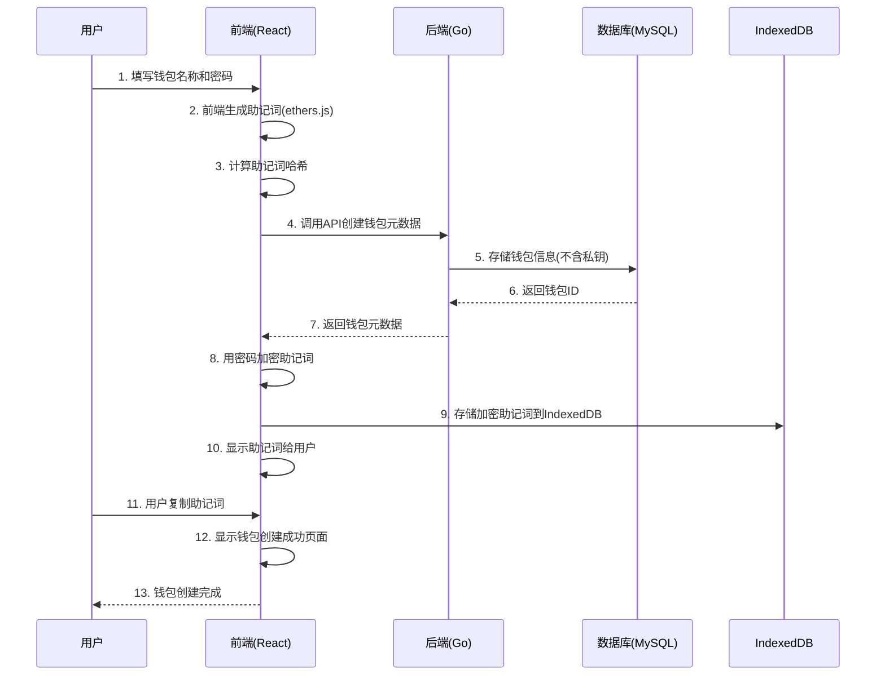

# 1. 创建钱包流程

这个流程展示了用户如何创建新钱包或导入现有钱包，包括私钥生成、地址派生和元数据存储。

## 时序图

## 详细步骤说明

### 步骤1：用户输入
- **钱包名称**：用户输入钱包名称
- **密码设置**：用户设置密码（用于加密助记词）
- **助记词长度**：选择12词或24词助记词

### 步骤2-3：前端生成
- **助记词生成**：使用ethers.js生成随机助记词
- **哈希计算**：计算助记词哈希（用于后端验证）
- **安全随机**：使用加密安全的随机数生成器

### 步骤4-7：后端存储
- **API调用**：前端调用后端API创建钱包元数据
- **数据存储**：后端将钱包信息存储到MySQL
- **返回ID**：后端返回钱包ID给前端
- **不存储私钥**：后端只存储助记词哈希，不存储原始助记词

### 步骤8-9：前端加密存储
- **密码加密**：使用用户密码加密助记词
- **本地存储**：将加密后的助记词存储到IndexedDB
- **安全隔离**：每个钱包使用独立的加密密钥

### 步骤10-13：用户确认
- **显示助记词**：前端显示生成的助记词给用户
- **用户复制**：用户复制助记词到剪贴板
- **确认页面**：显示钱包创建成功页面
- **安全提醒**：提醒用户安全保存助记词

## 关键设计点

### 安全性
- **私钥隔离**：私钥永远不离开用户设备
- **加密存储**：使用强加密算法保护私钥
- **无服务器依赖**：核心安全操作不依赖后端

### 多链支持
- **统一标准**：使用BIP44标准派生地址
- **地址兼容**：同一私钥在所有EVM链上生成相同地址
- **链管理**：支持动态添加新的区块链

### 用户体验
- **即时反馈**：操作结果立即显示
- **错误处理**：详细的错误提示和恢复建议
- **数据持久化**：钱包信息自动保存和恢复

## 相关代码

### 前端关键文件
- `src/services/KeyManager.ts` - 私钥管理
- `src/services/AddressService.ts` - 地址处理
- `src/utils/storage.ts` - 本地存储

### 后端关键文件
- `internal/handlers/wallet.go` - 钱包API
- `pkg/wallet/wallet.go` - 钱包业务逻辑
- `pkg/storage/mysql.go` - 数据存储
