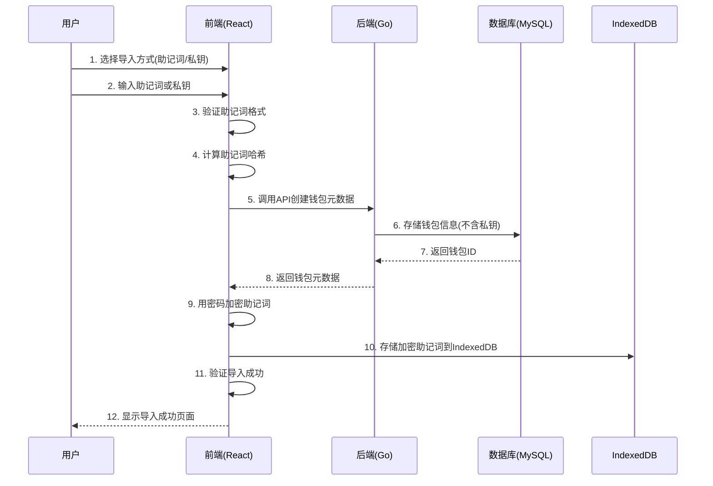

# 2. 导入钱包流程

这个流程展示了用户如何通过助记词或私钥导入现有钱包，包括验证、加密存储和账户恢复。

## 时序图



## 详细步骤说明

### 步骤1-2：用户输入
- **导入方式选择**：用户选择助记词或私钥导入
- **敏感信息输入**：用户输入助记词（12或24词）或私钥
- **钱包名称**：用户为新导入的钱包设置名称
- **密码设置**：用户设置密码（用于加密存储）

### 步骤3-4：前端验证
- **格式验证**：验证助记词长度和格式
- **有效性检查**：使用ethers.js验证助记词有效性
- **哈希计算**：计算助记词哈希（用于后端验证）
- **安全检查**：确保在安全环境中处理敏感信息

### 步骤5-8：后端存储
- **API调用**：前端调用后端API创建钱包元数据
- **数据存储**：后端将钱包信息存储到MySQL
- **返回ID**：后端返回钱包ID给前端
- **不存储私钥**：后端只存储助记词哈希，不存储原始助记词

### 步骤9-10：前端加密存储
- **密码加密**：使用用户密码加密助记词
- **本地存储**：将加密后的助记词存储到IndexedDB
- **安全隔离**：每个钱包使用独立的加密密钥

### 步骤11-12：导入完成
- **验证成功**：确认钱包导入成功
- **账户恢复**：可以基于导入的助记词派生账户
- **安全提醒**：提醒用户安全保存密码

## 支持的导入方式

### 助记词导入
- **标准支持**：支持12词和24词助记词
- **格式验证**：自动验证助记词格式和有效性
- **多语言**：支持BIP39标准的所有语言
- **错误提示**：提供详细的错误信息和修复建议

### 私钥导入（计划中）
- **十六进制格式**：支持0x前缀的64位十六进制私钥
- **格式验证**：验证私钥长度和格式
- **安全检查**：确保私钥在安全环境中处理
- **地址派生**：从私钥直接派生以太坊地址

## 安全特性

### 输入验证
- **实时验证**：用户输入时实时验证格式
- **错误提示**：提供清晰的错误信息和修复建议
- **格式检查**：确保助记词和私钥格式正确
- **长度验证**：验证助记词词数和私钥长度

### 加密存储
- **强加密**：使用AES-256-GCM加密算法
- **盐值随机化**：每个钱包使用不同的盐值
- **IV随机化**：每次加密使用不同的初始化向量
- **密码保护**：使用用户密码作为加密密钥

### 隐私保护
- **本地处理**：敏感信息只在用户设备上处理
- **无服务器存储**：私钥和助记词不发送到服务器
- **哈希验证**：后端只存储哈希值用于验证
- **安全传输**：所有网络传输使用HTTPS

## 错误处理

### 常见错误类型
- **格式错误**：助记词词数不正确或私钥格式错误
- **验证失败**：助记词校验和错误或私钥无效
- **网络错误**：后端API调用失败
- **存储错误**：本地存储失败

### 错误恢复
- **重试机制**：网络错误时自动重试
- **用户指导**：提供详细的错误修复建议
- **数据恢复**：支持重新导入和恢复
- **状态清理**：错误时清理临时数据

## 相关代码

### 前端关键文件
- `src/pages/ImportWalletPage.tsx` - 导入钱包页面
- `src/services/KeyManager.ts` - 私钥管理和验证
- `src/store/walletSlice.ts` - 钱包状态管理
- `src/utils/crypto.ts` - 加密解密工具

### 后端关键文件
- `internal/handlers/wallet.go` - 钱包API处理
- `pkg/wallet/wallet.go` - 钱包业务逻辑
- `pkg/storage/mysql.go` - 数据存储

### 核心实现

#### 前端验证逻辑
```typescript
// 验证助记词格式
const validateMnemonic = (mnemonic: string): boolean => {
  if (!mnemonic.trim()) return false;
  const words = mnemonic.trim().split(/\s+/);
  return words.length === 12 || words.length === 24;
};

// 使用ethers.js验证助记词
static validateMnemonic(mnemonic: string): boolean {
  try {
    ethers.Mnemonic.fromPhrase(mnemonic);
    return true;
  } catch {
    return false;
  }
}
```

#### 导入流程实现
```typescript
export const importWallet = createAsyncThunk(
  'wallet/importWallet',
  async (request: ImportWalletRequest, { rejectWithValue }) => {
    try {
      // 1. 验证助记词
      if (!KeyManager.validateMnemonic(request.mnemonic)) {
        throw new Error('Invalid mnemonic phrase');
      }
      
      // 2. 后端存储元数据
      const wallet = await walletService.createWallet({
        name: request.name,
        type: 'mnemonic',
        mnemonic_hash: KeyManager.hashMnemonic(request.mnemonic)
      });
      
      // 3. 前端加密存储
      const encrypted = await KeyManager.encryptMnemonic(request.mnemonic, request.password);
      await saveVault({
        walletId: wallet.id,
        encryptedMnemonic: encrypted.encrypted,
        salt: encrypted.salt,
        iv: encrypted.iv,
        createdAt: Date.now(),
        updatedAt: Date.now(),
      });
      
      return { wallet, mnemonic: request.mnemonic };
    } catch (error: any) {
      return rejectWithValue(error.message || 'Failed to import wallet');
    }
  }
);
```

## 最佳实践

### 用户安全
- **环境检查**：确保在安全环境中输入敏感信息
- **密码强度**：使用强密码保护钱包
- **备份提醒**：提醒用户备份助记词
- **定期更新**：定期更新密码和检查安全设置

### 开发安全
- **输入清理**：清理和验证所有用户输入
- **错误处理**：不泄露敏感信息在错误消息中
- **日志安全**：不在日志中记录敏感信息
- **测试覆盖**：确保所有安全路径都有测试覆盖
