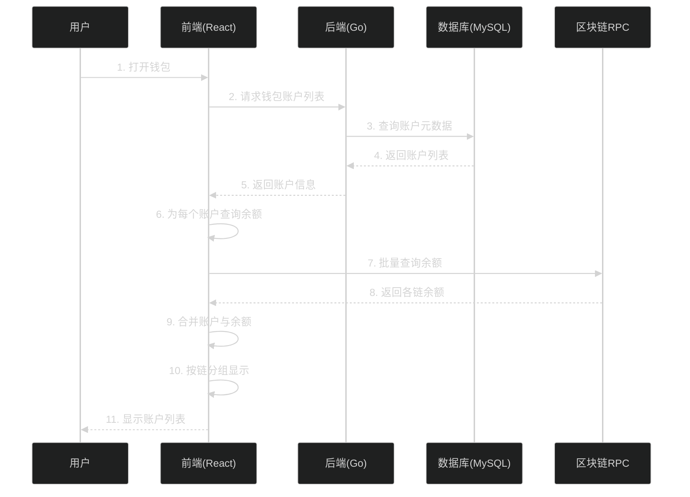

# 4. 查询钱包账户流程

这个流程展示了如何查询钱包下的所有账户，包括多链账户展示和余额查询。

## 时序图



## 详细步骤说明

### 步骤1：用户打开钱包
- **选择钱包**：用户从钱包列表选择一个钱包
- **查看账户**：点击查看钱包详情
- **触发查询**：前端自动触发账户查询

### 步骤2-5：后端查询账户
- **API调用**：前端调用后端API查询账户列表
- **参数传递**：钱包ID
- **数据库查询**：后端从MySQL查询该钱包的所有账户
- **返回数据**：返回账户列表（链ID、地址、余额等）

### 步骤6-8：批量查询余额
- **账户遍历**：前端遍历每个账户
- **RPC调用**：为每个账户调用对应链的RPC查询余额
- **并行查询**：可以并行查询多条链的余额
- **结果收集**：收集所有账户的余额

### 步骤9-11：UI展示
- **数据合并**：将账户元数据和余额合并
- **按链分组**：按区块链分组显示账户
- **余额格式化**：格式化显示余额（ETH, MATIC等）
- **实时更新**：可以定期刷新余额

## 技术实现

### 前端批量查询余额

```typescript
// 批量查询账户余额
async function queryAccountsWithBalance(walletId: string) {
  // 1. 从后端获取账户列表
  const accounts = await walletService.getAccounts(walletId);
  
  // 2. 按链分组账户
  const accountsByChain = groupBy(accounts, 'chain_id');
  
  // 3. 并行查询各链余额
  const balancePromises = Object.entries(accountsByChain).map(
    async ([chainId, chainAccounts]) => {
      const rpcUrl = getRpcUrl(parseInt(chainId));
      const provider = new ethers.JsonRpcProvider(rpcUrl);
      
      return Promise.all(
        chainAccounts.map(async (account) => {
          const balance = await provider.getBalance(account.address);
          return {
            ...account,
            balance: ethers.formatEther(balance),
          };
        })
      );
    }
  );
  
  // 4. 等待所有查询完成
  const results = await Promise.all(balancePromises);
  
  // 5. 扁平化结果
  return results.flat();
}
```

### 后端查询账户API

```go
// GetAccounts 获取钱包的所有账户
func (h *AccountHandler) GetAccounts(c *gin.Context) {
    walletID := c.Param("wallet_id")
    
    accounts, err := h.accountService.GetAccountsByWallet(walletID)
    if err != nil {
        utils.InternalError(c, "Failed to get accounts")
        return
    }
    
    utils.Success(c, accounts)
}

// GetAccountsByWallet 根据钱包ID查询账户
func (s *accountService) GetAccountsByWallet(walletID string) ([]*types.Account, error) {
    return s.storage.GetAccountsByWallet(walletID)
}
```

### 按链分组显示

```typescript
// 按链分组账户
function groupAccountsByChain(accounts: Account[]): Record<string, Account[]> {
  return accounts.reduce((acc, account) => {
    const chainName = getChainName(account.chain_id);
    if (!acc[chainName]) {
      acc[chainName] = [];
    }
    acc[chainName].push(account);
    return acc;
  }, {} as Record<string, Account[]>);
}

// 链信息映射
const chainInfo = {
  1: { name: 'Ethereum', symbol: 'ETH', decimals: 18 },
  137: { name: 'Polygon', symbol: 'MATIC', decimals: 18 },
  42161: { name: 'Arbitrum', symbol: 'ETH', decimals: 18 },
  10: { name: 'Optimism', symbol: 'ETH', decimals: 18 },
};
```

## 优化策略

### 批量查询优化
- **并行请求**：同时查询多条链的余额
- **缓存策略**：缓存最近查询的余额
- **增量更新**：只更新有变化的账户

### 性能优化
- **分页加载**：如果账户很多，分页加载
- **虚拟滚动**：使用虚拟滚动优化长列表
- **防抖更新**：避免频繁刷新余额

### 用户体验
- **加载状态**：显示查询进度
- **骨架屏**：加载时显示骨架屏
- **错误处理**：优雅处理网络错误

## 相关代码

### 前端关键文件
- `src/services/BalanceService.ts` - 余额查询服务
- `src/components/AccountList.tsx` - 账户列表组件
- `src/store/accountSlice.ts` - 账户状态管理

### 后端关键文件
- `internal/handlers/account.go` - 账户API处理
- `pkg/account/account.go` - 账户业务逻辑
- `pkg/rpc/client.go` - RPC客户端

## UI展示效果

### 账户卡片示例
```
┌─────────────────────────────────────┐
│  Ethereum Mainnet                   │
│  ┌───────────────────────────────┐  │
│  │ 0x742...c4f                   │  │
│  │ 1.234 ETH                     │  │
│  └───────────────────────────────┘  │
├─────────────────────────────────────┤
│  Polygon                            │
│  ┌───────────────────────────────┐  │
│  │ 0x742...c4f                   │  │
│  │ 50.678 MATIC                  │  │
│  └───────────────────────────────┘  │
└─────────────────────────────────────┘
```
